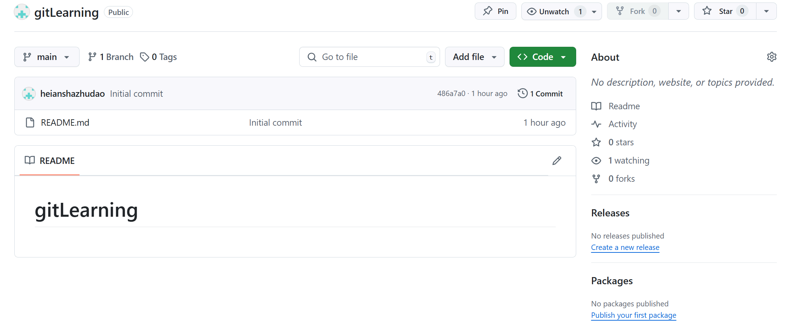
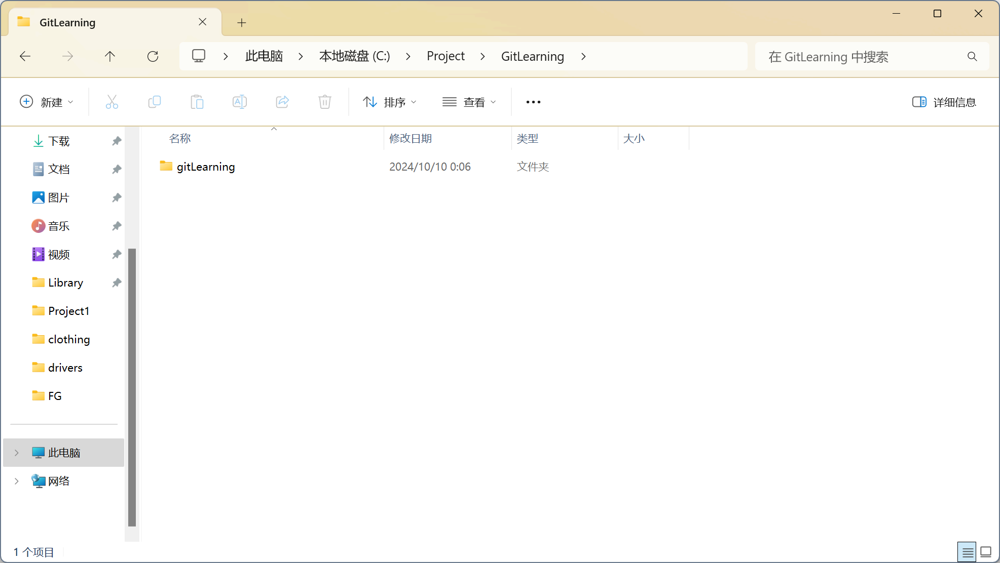
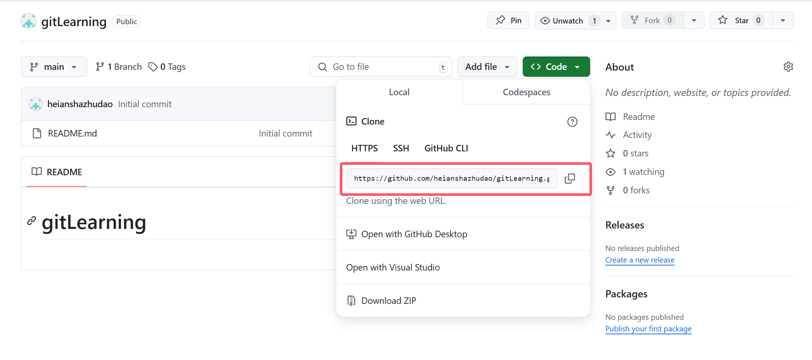
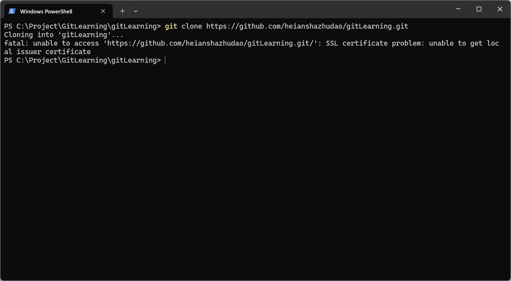
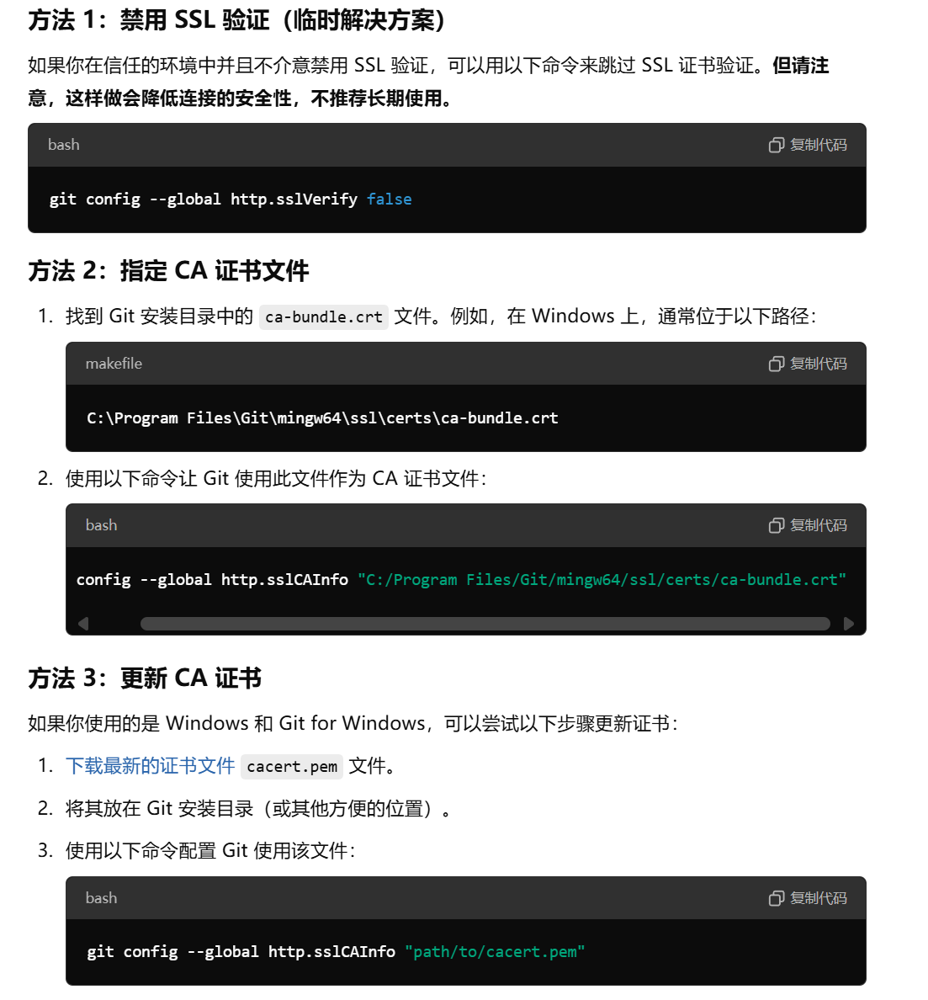
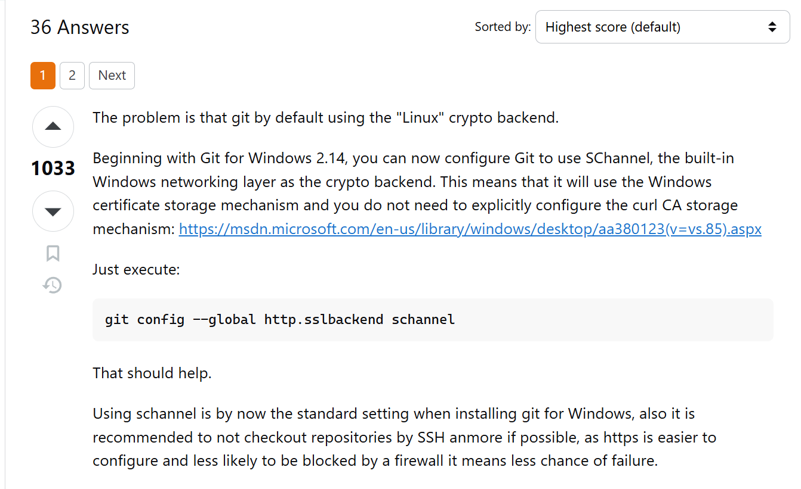
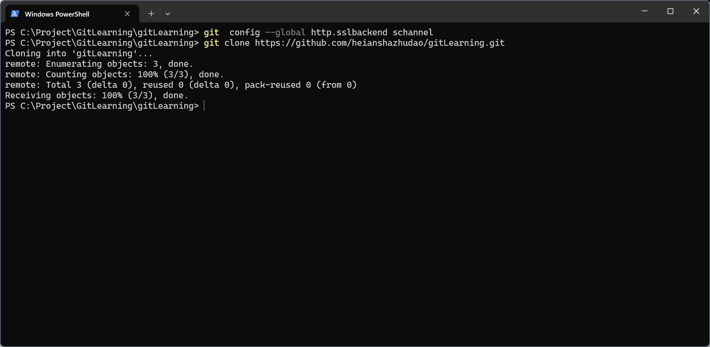

---
# ---------------------------------------------------------
# Hugo 文章元数据配置（包含标签与分类）
# ---------------------------------------------------------

# 文章的标题
title: "Github项目的克隆"

# 文章的发布时间（ISO 8601 格式）
date: 2026-06-04T20:00:00+08:00

# 是否为草稿（false 代表正式发布，如果是 true 则网站上不会显示）
draft: false

# 给文章打上具体的标签（数组格式，支持多个，用英文逗号隔开，建议写具体的技巧或工具名）
tags: ["Github","Git"]

# 给文章划分宏观大类（通常比标签更宽泛，比如属于某个知识体系）
categories: ["踩坑记录"]
---

## 克隆远程仓库到本地

首先在Github中创建一个仓库



创建一个文件夹用来存放该仓库



查看GitHub上的仓库的地址并复制下来



在终端中输入 

```git
git clone https://github.com/heianshazhudao/gitLearning.git
```


报错fatal: unable to access 'https://github.com/heianshazhudao/gitLearning.git/': SSL certificate problem: unable to get local issuer certificate，提示SSL证书有问题

github上提供了三种解决方法，第一种是临时解决方案，第二种和第三种试过都没有效果



在StackOverflow上找到了解决方法，按照该方法成功解决问题并克隆了仓库



